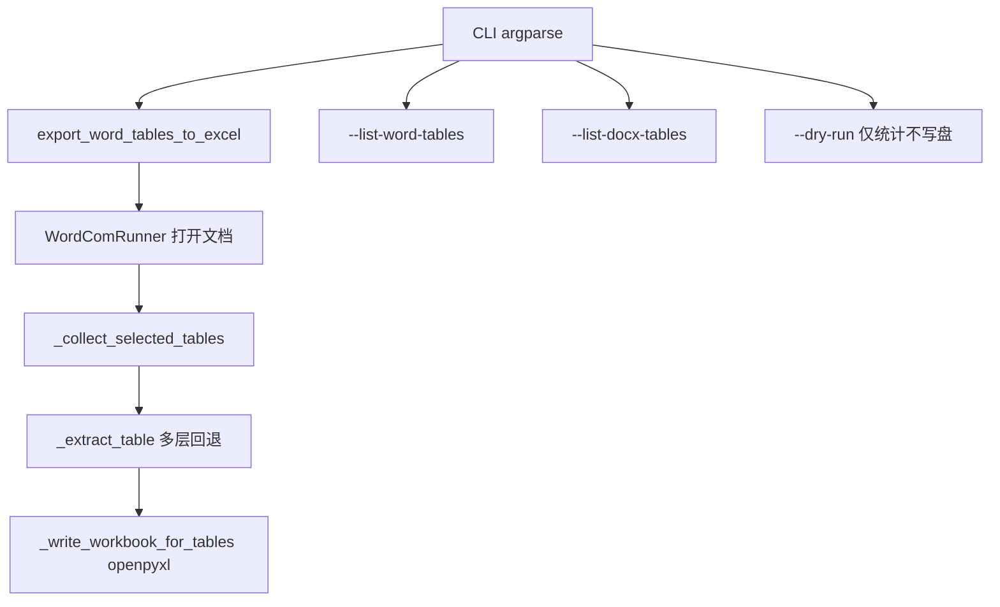

# 24_Word_Tables_to_Excel

把 Word（`.doc/.docx/.rtf`）中的**指定表格**导出为 Excel（`.xlsx`），并尽量保证：

- 表头**精准对齐**（支持多行表头合并为“多级表头”）
- 单元格内容清洗（去除 Word 单元格结束符等）
- 输出文件对 Office/国产 WPS 具备良好兼容性（使用 `openpyxl` 生成标准 xlsx）

## 运行环境

- Windows + 安装 Microsoft Word（使用 `pywin32` 的 COM 自动化读取表格）
- Python 3.8+

## 输入输出

- 输入目录：`24_Word_Tables_to_Excel/input/`
- 输出目录：`24_Word_Tables_to_Excel/output/`

> 注意：仓库根目录的 `.gitignore` 默认不会提交 `input/` / `output/` / `Template/` 下的数据文件，只保留 `README.md` 以保留目录结构。

## 快速开始

1) 把 Word 放入 `input/`（例如 `source.docx`）

2) 运行（按表格序号导出，第 1、3 个表格）：

```bash
cd 24_Word_Tables_to_Excel
python word_tables_to_excel.py --input "input/source.docx" --table-indices 1,3
```

2.1) 运行（只导出单个表格，速度更快）：

```bash
cd 24_Word_Tables_to_Excel
python word_tables_to_excel.py --input "input/source.docx" --table-index 9
```

3) 运行（按表头关键字定位表格；命中则导出）：

```bash
cd 24_Word_Tables_to_Excel
python word_tables_to_excel.py --input "input/source.docx" --header-keywords "系统器官分类,首选术语"
```

## 参数说明

- `--input`：Word 文件路径
- `--output`：输出 xlsx 路径（默认：`output/<word文件名>_tables.xlsx`）
- `--table-indices`：要导出的表格序号（Word 内 `doc.Content.Tables` 的 **1-based** index，例如 `1,3,5`）
- `--table-index`：只导出单个表格序号（1-based），例如 `9`（会覆盖 `--table-indices`）
- `--header-keywords`：用表头关键字自动筛表（逗号分隔）；若同时提供 `--table-indices`，优先按序号
- `--header-rows`：认为“表头占用的行数”（默认 1）。会将多行表头合并为一行列名（`"A / B"`）
- `--merge-tables-from` / `--merge-tables-to`：当 Word 将**视觉上连续的一张表**拆成多个**顶层** `Document.Tables` 时，按序号区间纵向合并（`--merge-tables-to` 缺省为文档最后一个表）
- `--list-word-tables`：启动 Word，列出**顶层表**序号与行列数（与 `--table-index` 使用的序号一致）
- `--list-docx-tables`：不启动 Word，仅解析 `document.xml` 中每个 `<w:tbl>` 的大致行数；**含单元格内嵌套表**，段数往往多于 Word 顶层表数，**不能**直接当作 `--table-index`
- `--quiet`：减少自检信息输出
- `--dry-run`：只抽取并打印行列统计，不写 xlsx（大表自检）

## 重要说明（序号与“完整性”）

- Word 里 **`Document.Tables` 的个数** = 本工具使用的 `--table-index` 序号。若 `document.xml` 里 `<w:tbl>` 很多，多半是**嵌套表格**被单独计数，与顶层表序号不是同一套编号。
- 若整表 `Range.Text` 过大，历史上可能出现**截断**；当前实现已对大表优先 **按行** `Rows(r).Range.Text` 解析，并带行列数自检（stderr）。

## 参数优先级（与代码一致）

1. `--merge-tables-from`（并可选 `--merge-tables-to`）— 与 `--table-title` / `--table-index` 互斥，启用合并时会忽略表题与序号  
2. `--table-title`  
3. `--table-indices` 或 `--table-index`  
4. 未指定序号时：全量抽取后按 `--header-keywords` 筛选；再无关键字则导出全部顶层表  

## 架构与数据流



## 自检与排错

- 先看 **`--list-word-tables`**，确认要导的**顶层表序号**与行列数。  
- 大表先用 **`--dry-run`**（配合 `--table-index` 或合并参数），确认 `rows/cols` 与 Word 一致后再去 `--dry-run` 写 xlsx。  
- 若 stderr 出现 **`[自检]`** 行列不一致，多为复杂合并格；可尝试改 `--header-rows` 或检查原表结构。  

## 推荐命令（大表，如 CSR 附录长表）

**耗时说明**：顶层表若有数千行，按行 COM 读取仍可能需数分钟甚至更久，属正常现象；可先用 `--dry-run` 确认行列数再正式导出。

```bash
python word_tables_to_excel.py --input "input/报告.docx" --list-word-tables
python word_tables_to_excel.py --input "input/报告.docx" --table-index 9 --dry-run
python word_tables_to_excel.py --input "input/报告.docx" --table-index 9 -o "output/报告_table9.xlsx"
```

若 Word 将一张长表拆成多段**顶层表**，用合并区间（序号以 `--list-word-tables` 为准）：

```bash
python word_tables_to_excel.py --input "input/报告.docx" --merge-tables-from 8 --merge-tables-to 9 -o "output/报告_merged_8_9.xlsx"
```
