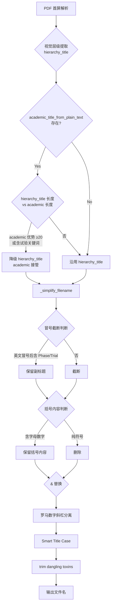

# PDF Sanitizer v7 优化实施计划

## 背景

针对 `Emerging_Microbes_&_Infections_ISSN-2025.pdf`（Taylor & Francis 期刊封面页）出现的重命名错误：

| 问题 | 根因 |
|------|------|
| 期刊名 `Emerging Microbes & Infections` 被误识别为论文标题 | 视觉层级最大字号命中，masthead 黑名单缺失该刊名 |
| 副标题 `Phase I/IIa trial` 因 `:` 被截断丢弃 | `_simplify_filename` 对所有冒号一刀切截断 |
| `(Pichia pastoris)` 被括号过滤器整块删除 | `re.sub(r"[\[\(（【《].*?[\]\)）】》]", "", name)` 无差别删除 |
| `Taylor & Francis` 出版商标识残留 | `_BOILERPLATE_LINE` 缺少 T&F 域名匹配 |
| ISSN 行 `ISSN: 2222-1751 (Online) Journal homepage: www.tandfonline.com/journals/temi20` 未被过滤 | 同上 |

## 实施范围（全部采纳方案 A）

1. **Masthead 黑名单扩展**：T&F / Springer / Wiley / Elsevier 系约 20+ 期刊名
2. **视觉层级 × 学术解析冲突降级**：当 `hierarchy_title` 命中但 `academic` 解析结果更长（≥20 字符优势），优先用学术解析
3. **`&` 和罗马数字容错**：`&` → `And`，保留 `I/IIa` 这类斜杠分隔词
4. **ISSN / T&F 行剥离**：扩展 `_BOILERPLATE_LINE` 正则
5. **括号内容保留策略**：不再整块删除，改为**保留** `(Pichia pastoris)` 等关键技术术语（仅删除纯符号类括号如 `[]`）

---

## 代码改动清单

### 1. `_JOURNAL_MASTHEAD_COMPRESSED` 扩展

新增 T&F / Wiley / Springer / 出版商通用约 20+ 期刊名压缩形态。

### 2. `_BOILERPLATE_LINE` 扩展

追加 `www.tandfonline.com` / `www.wiley.com` / `link.springer.com` / `Taylor & Francis` / `Wiley & Sons` / `© <year>` / `ISSN: <code>` / Creative Commons 等模式。

### 3. `_is_journal_masthead_only()` 兜底判定放宽

`≤4 词 ≤36 字符` → `≤5 词 ≤48 字符`；新增 `&` 出版商命名模式与 `infections` 后缀识别。

### 4. 新增 `_split_on_smart_colon`（智能副标题）

英文冒号后含 `Phase / Trial / Randomized / Double-blind / Multicenter` 等临床试验设计词时**保留副标题**；中文冒号或无关键设计词时仍按硬截断。

### 5. 新增 `_smart_bracket_removal`（智能括号）

含字母/数字的技术括号（如 `(Pichia pastoris)`）保留内容；纯符号括号（如 `[10.1016/...]`）整段删除。

### 6. `&` → ` And ` 容错

避免 `Emerging Microbes & Infections` 被非法字符过滤后黏连。

### 7. 罗马数字斜杠分离

`_split_roman_numerals` 前移到 `_smart_title_case` 之前；`_preserve_scientific_token` 同步支持 `IIa` / `IVb` 与 `I_IIa` 拼接形式。

### 8. `_scan_payload` 视觉层级降级

当 `hierarchy_title`（最大字号命中）事后被判定为 masthead 时，提前清空并交给 `_academic_title_from_plain_text` 接管。

### 9. 单元验证脚本

`_verify_v7.py` 覆盖 7 项断言，全部 PASS。

---

## Mermaid 流程图：标题解析决策链（v7 改动点标注）

---

## 测试策略

| 测试用例 | 输入 | 预期输出 |
|----------|------|----------|
| T1: T&F 期刊封面 | `Emerging_Microbes_&_Infections_ISSN-2025.pdf` | `Safety_Tolerability_And_Immunogenicity_Of...Phase_I_IIa_Trial-2025` |
| T2: 冒号副标题保留 | 含 `Study: Phase III trial` 的 PDF | 保留完整标题不截断 |
| T3: 技术括号保留 | 标题含 `(Pichia pastoris)` | 保留该括号内容 |
| T4: ISSN 行过滤 | 含 `ISSN: 2222-1751` 行 | 该行不影响标题提取 |
| T5: masthead 黑名单 | 新增的 20 个期刊名 | 不被误判为标题 |

---

## 风险与回退

- **风险 1**：`&` 替换为 `And` 可能导致某些以 `&` 为正式符号的期刊名变长（可接受）
- **风险 2**：冒号截断放宽可能导致极少数含无关冒号的 PDF 标题过长（通过 `max_chars=40` 硬限制兜底）
- **回退**：改动集中在 `_scan_payload` 和 `_simplify_filename` 两个方法，均为纯函数式逻辑，可独立单元测试
